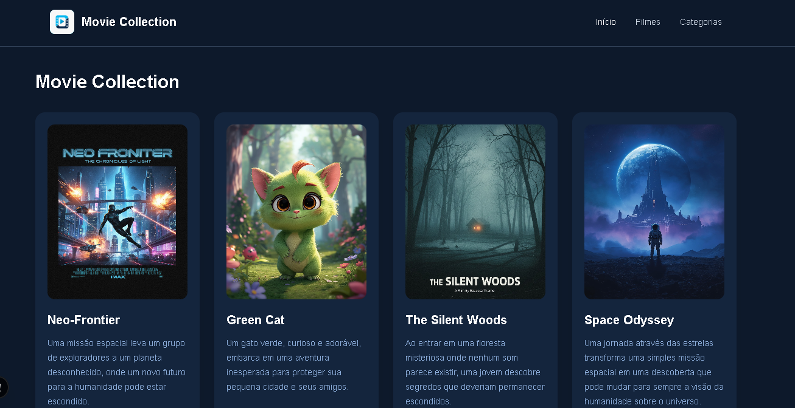
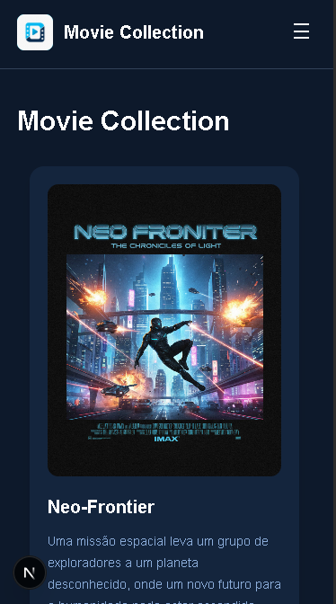

# Movie Collection

O Movie Collection é uma aplicação web desenvolvida para apresentar uma seleção de filmes por meio de cards informativos e interativos.

O projeto foi desenvolvido utilizando **Next.js**, com **React**, **JavaScript** e **Tailwind CSS**. A aplicação possui design responsivo, permitindo sua utilização em diferentes tamanhos de tela.

## Tecnologias utilizadas

* Next.js
* React
* JavaScript
* Tailwind CSS
* Animate.css
* Git e GitHub
* Leonardo AI

## Funcionalidades

* Exibição de filmes em cards
* Informações sobre título, descrição, gênero e ano
* Efeitos de interação nos cards
* Animações utilizando Animate.css
* Layout responsivo para desktop e dispositivos móveis
* Logo desenvolvida com auxílio de inteligência artificial

## Desenvolvimento

O projeto foi desenvolvido como uma adaptação do desafio **NFT Preview Card Component**, da Frontend Mentor. A proposta original foi adaptada para uma aplicação de apresentação e seleção de filmes.

As imagens utilizadas no projeto e a logo foram desenvolvidas com auxílio do Leonardo AI.

## Imagens da aplicação

### Desktop

### Mobile

[ Vídeo de demonstração](public/videos/demo.mp4)